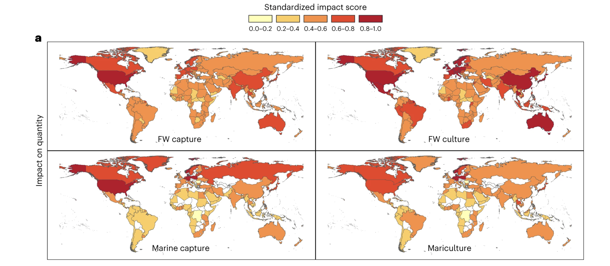

Global aquatic or ‘blue’ foods, essential to over 3.2 billion people, face challenges of maintaining supply in a changing environment while adhering to safety and sustainability standards. Despite the growing concerns over their environmental impacts, limited attention has been paid to how blue food production is influenced by anthropogenic environmental changes. Here we assess the vulnerability of global blue food systems to predominant environmental disturbances and predict the spatial impacts. Over 90% of global blue food production faces substantial risks from environmental change, with the major producers in Asia and the United States facing the greatest threats. Capture fisheries generally demonstrate higher vulnerability than aquaculture in marine environments, while the opposite is true in freshwater environments. While threats to production quantity are widespread across marine and inland systems, food safety risks are concentrated within a few countries. Identifying and supporting mitigation and adaptation measures in response to environmental stressors is particularly important in developing countries in Asia, Latin America and Africa where risks are high and national response capacities are low. These findings lay groundwork for future work to map environmental threats and opportunities, aiding strategic planning and policy development for resilient and sustainable blue food production under changing conditions.

Access the article [**here**](https://doi.org/10.1038/s41893-023-01156-y){.external target="_blank"}.

{fig-align="center"}