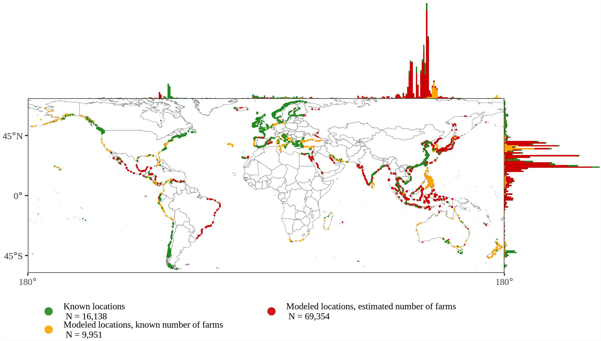

Mariculture (marine and brackish water aquaculture) has grown rapidly over the past 20 years, yet publicly-available information on the location of mariculture production is sparse. Identifying where mariculture production occurs remains a major challenge for understanding its environmental impacts and the sustainability of individual farms and the sector as a whole. We compiled known mariculture locations and applied a simple production-allocation approach to map remaining global mariculture locations across 73 countries using the key determinants of distance to shore and ports, and average productivity (tonnage) of known farms. Our map represents 96% of reported fish and invertebrate mariculture production for 2017, but excludes algae which constitutes half of global mariculture production. We provide, for the first time, a publicly available spatial database of known and estimated mariculture locations. We discuss the utility and limitations of the existing data and our modeling approach, and highlight the key data gaps and future challenges for mapping aquaculture. Our results provide a vital resource for mariculture and environmental researchers, but we emphasize the need for a standardized, ground-truthed global spatial database of aquaculture locations and farm-level attributes (e.g., species, production type) to better understand the distribution of production and adequately plan for future growth.

Access the article [**here**](https://doi.org/10.1016/j.aquaculture.2022.738066){.external target="_blank"}.

{fig-align="center"}