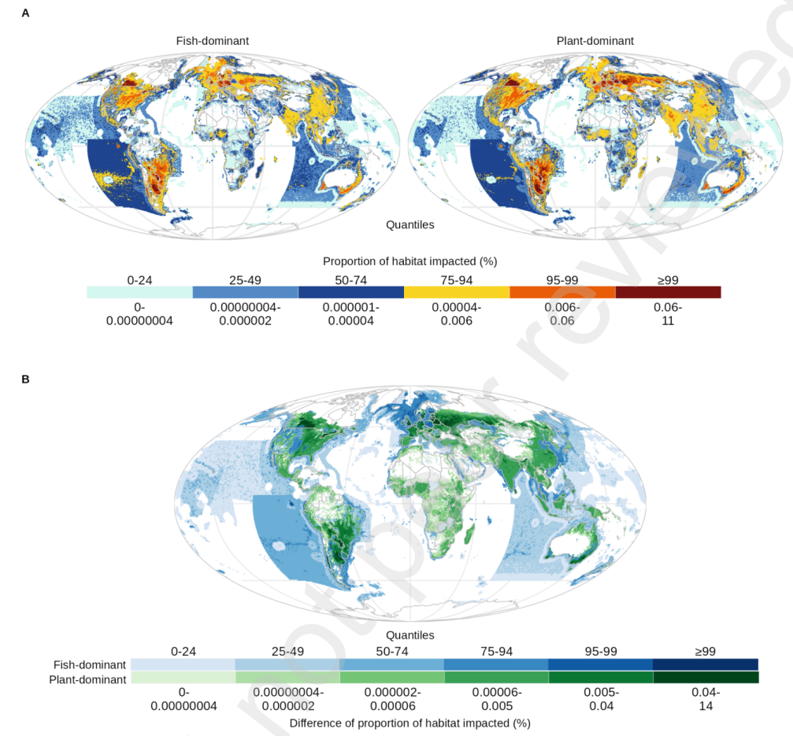

Aquaculture is a growing industry crucial to global food security, but its biodiversity impact, particularly from feed production, remains poorly understood. We present a new spatial approach to quantify the habitat loss associated with the production of animal feeds, using Atlantic salmon aquaculture as a case study. We examine habitat impacts for over 50,000 marine and terrestrial species from producing feeds for global Atlantic salmon production under two feed scenarios. To reduce historical wild fish use in feeds, salmon aquaculture has increased its reliance on agricultural inputs. We show how this shift can disproportionately increase impacts for terrestrial species and highlight how careful decisions about feed sourcing are imperative to curb biodiversity impacts. As global demand for seafood continues to rise, these methods and findings can guide policymakers and industry stakeholders toward more informed decisions to improve aquaculture sustainability.

Access the article [**here**](https://doi.org/10.1016/j.crsus.2025.100457){.external target="_blank"}.

{fig-align="center"}