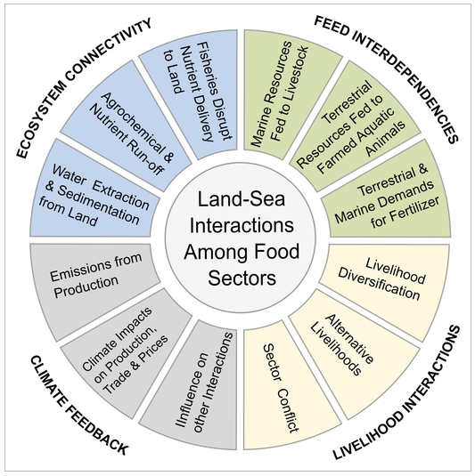

With the human population expected to near 10 billion by 2050, and diets shifting towards greater per-capita consumption of animal protein, meeting future food demands will place ever-growing burdens on natural resources and those dependent on them. Solutions proposed to increase the sustainability of agriculture, aquaculture, and capture fisheries have typically approached development from single sector perspectives. Recent work highlights the importance of recognising links among food sectors, and the challenge cross-sector dependencies create for sustainable food production. Yet without understanding the full suite of interactions between food systems on land and sea, development in one sector may result in unanticipated trade-offs in another. We review the interactions between terrestrial and aquatic food systems. We show that most of the studied land–sea interactions fall into at least one of four categories: ecosystem connectivity, feed interdependencies, livelihood interactions, and climate feedback. Critically, these interactions modify nutrient flows, and the partitioning of natural resource use between land and sea, amid a backdrop of climate variability and change that reaches across all sectors. Addressing counter-productive trade-offs resulting from land-sea links will require simultaneous improvements in food production and consumption efficiency, while creating more sustainable feed products for fish and livestock. Food security research and policy also needs to better integrate aquatic and terrestrial production to anticipate how cross-sector interactions could transmit change across ecosystem and governance boundaries into the future.

Access the article [**here**](https://doi.org/10.1111/gcb.13873){.external target="_blank"}.

{fig-align="center"}