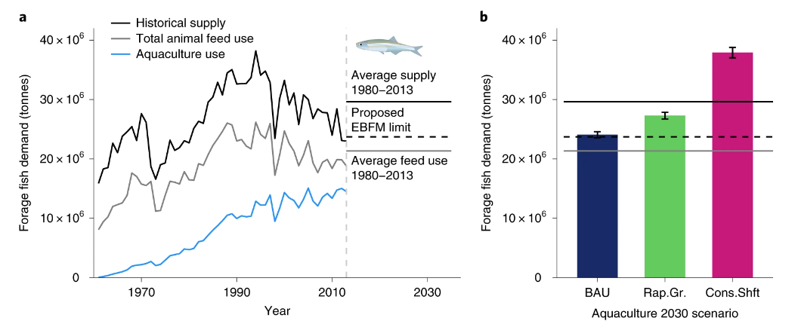

With the global supply of forage fish at a plateau, fed aquaculture must continue to reduce dependence on fishmeal and oil in feeds to ensure sustainable sector growth. The use of novel aquaculture feed ingredients is growing, but their contributions to scalable and sustainable aquafeed solutions are unclear. Here, we show that global adoption of novel aquafeeds could substantially reduce aquaculture’s forage fish demand by 2030, maintaining feed efficiencies and omega-3 fatty acid profiles. We combine production data, scenario modelling and a decade of experimental data on forage fish replacement using microalgae, macroalgae, bacteria, yeast and insects to illustrate how reducing future fish oil demand, particularly in high-value species such as salmonids, will be key for the sustainability of fed aquaculture. However, considerable uncertainties remain surrounding novel feed efficacy across different life-cycle stages and taxa, and various social, environmental, economic and regulatory challenges will dictate their widespread use. Yet, we demonstrate how even limited adoption of novel feeds could aid sustainable aquaculture growth, which will become increasingly important for food security.

Access the article [**here**](https://www.nature.com/articles/s43016-020-0078-x){.external target="_blank"}.

{fig-align="center"}