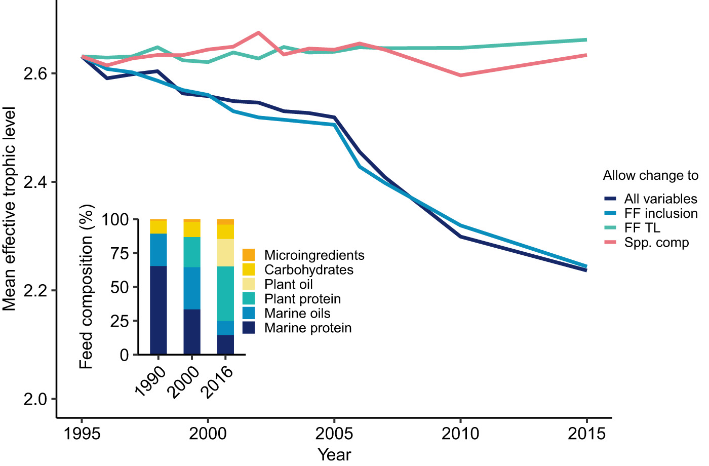

Aquaculture policy often promotes production of low-trophic level species for sustainable industry growth. Yet, the application of the trophic level concept to aquaculture is complex, and its value for assessing sustainability is further complicated by continual reformulation of feeds. The majority of fed farmed fish and invertebrate species are produced using human-made compound feeds that can differ markedly from the diet of the same species in the wild and continue to change in composition. Using data on aquaculture feeds, we show that technical advances have substantially decreased the mean effective trophic level of farmed species, such as salmon (mean TL = 3.48 to 2.42) and tilapia (2.32 to 2.06), from 1995 to 2015. As farmed species diverge in effective trophic level from their wild counterparts, they are coalescing at a similar effective trophic level due to standardisation of feeds. This pattern blurs the interpretation of trophic level in aquaculture because it can no longer be viewed as a trait of the farmed species, but rather is a dynamic feature of the production system. Guidance based on wild trophic position or historical resource use is therefore misleading. Effective aquaculture policy needs to avoid overly simplistic sustainability indicators such as trophic level. Instead, employing empirically derived metrics based on the specific farmed properties of species groups, management techniques and advances in feed formulation will be crucial for achieving truly sustainable options for farmed seafood.

Access the article [**here**](https://doi.org/10.1111/raq.12535){.external target="_blank"}.

{fig-align="center"}