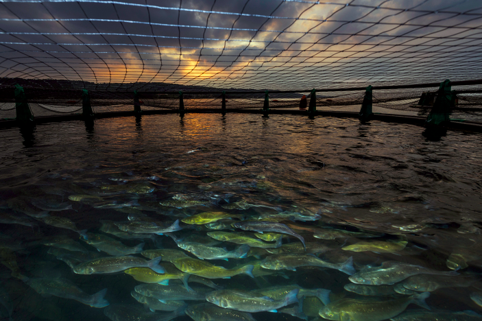

Industrial greenhouse gas emissions and human food production are major drivers of global environmental change. A key source of the environmental impact of our food systems comes from sourcing feed for farmed animals. In the rapidly growing fish farming or ‘aquaculture’ industry, feed producers have historically obtained key nutrients and minerals from fishmeal and oil — processed ingredients from the dedicated capture of small wild fish. But as these wild species are nearing global catch limits and are vulnerable to further fishing pressure1, aquaculture industries need to look elsewhere to source feed ingredients as global demand for farmed seafood grows. Writing in Nature Sustainability, El Abbadi and colleagues2 illustrate how a fishmeal alternative could be produced cost effectively, at scale and with existing technology through the capture of industrial methane emissions by bacteria; a potential win–win for climate action and sustainable food production.

Access the article [**here**](https://doi.org/10.1038/s41893-021-00798-0){.external target="_blank"}.

{fig-align="center"}
