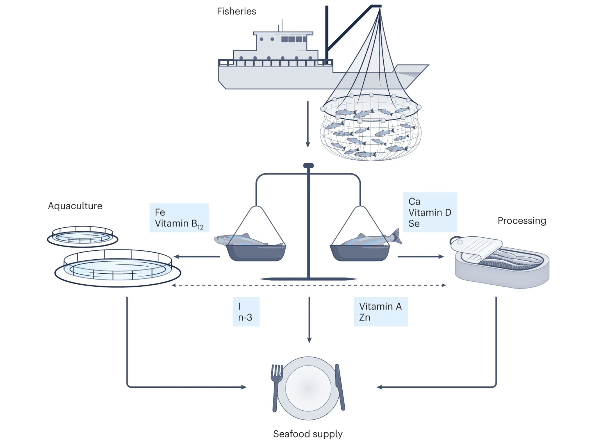

Wild forage fish can provide nutrients essential for human health, yet some nutrients may be lost when forage fish are used as aquafeeds. Reallocating a third of food-grade forage fish towards direct human consumption can optimize seafood systems to deliver dietary nutrients for feed and food at different scales.

Small marine ‘forage fish’ such as anchovies, herring and mackerel are rich in vitamins, minerals and omega-3 fatty acids and are among the most nutritious forms of seafood available1. Forage fish are an important resource for food and nutritional security in many coastal nations. However, a lack of demand for forage fish among wealthier consumers and a high demand from feed industries means much of this nutritious resource is processed into fishmeal and oil2 (Fig. 1). Salmon farming is a major user of fishmeal and oil but, unlike forage fish, there is growing familiarity and demand for salmon products and the health benefits they confer. Salmon is one of the most efficiently farmed species for converting feed into food3, but it remains unclear how efficiently micronutrients in forage fish are retained for human consumption.

Access the article [**here**](https://doi.org/10.1038/s43016-024-00933-y){.external target="_blank"}.

{fig-align="center"}