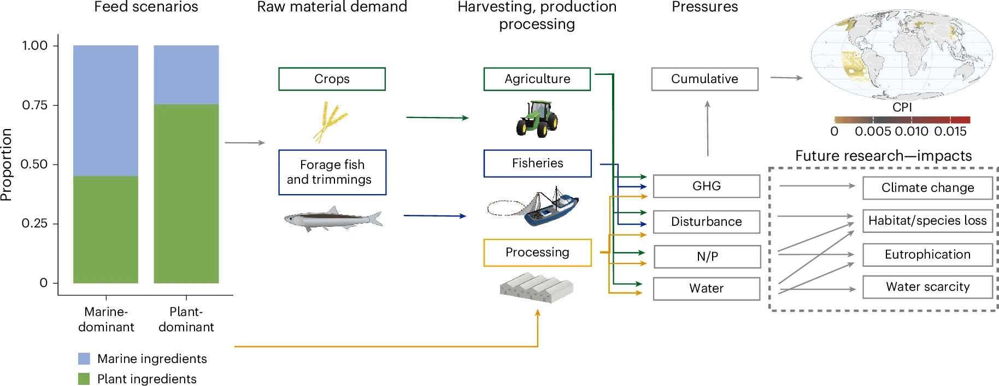

The net environmental implications of shifting aquaculture feed provisioning from wild-caught fishmeal to crop-based ingredients remain understudied, with little attention paid to multiple environmental pressures or the importance of where ingredients are sourced from. Here we model the change in environmental footprint (a cumulative and spatial measure of greenhouse gas emissions, habitat disturbance, excess nutrient and water consumption pressures) of shifting dependence from largely fish-based to plant-based ingredients in feeds for Atlantic salmon farming. We show that average differences exist between feeds in their cumulative and individual environmental pressures, but more importantly, the locations where feed raw materials are produced and processed drives far more variability in footprint within a feed than the typical variation between feeds. We demonstrate that responsible sourcing will be critical for sustainable feed production across all farming systems as the next generation of ingredients is developed.

Access the article [**here**](https://doi.org/10.1038/s43016-025-01236-6){.external target="_blank"}.

{fig-align="center"}