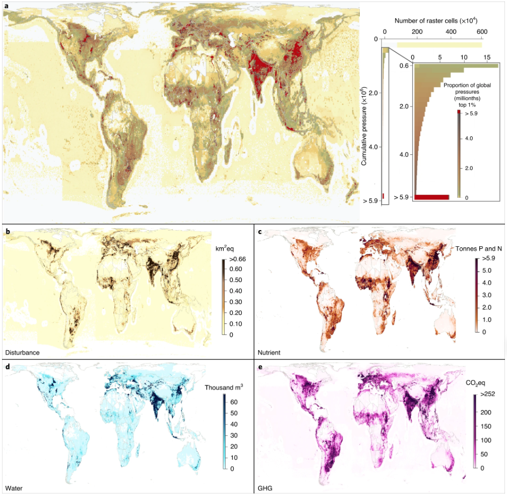

Feeding humanity puts enormous environmental pressure on our planet. These pressures are unequally distributed, yet we have piecemeal knowledge of how they accumulate across marine, freshwater and terrestrial systems. Here we present global geospatial analyses detailing greenhouse gas emissions, freshwater use, habitat disturbance and nutrient pollution generated by 99% of total reported production of aquatic and terrestrial foods in 2017. We further rescale and combine these four pressures to map the estimated cumulative pressure, or ‘footprint’, of food production. On land, we find five countries contribute nearly half of food’s cumulative footprint. Aquatic systems produce only 1.1% of food but 9.9% of the global footprint. Which pressures drive these footprints vary substantially by food and country. Importantly, the cumulative pressure per unit of food production (efficiency) varies spatially for each food type such that rankings of foods by efficiency differ sharply among countries. These disparities provide the foundation for efforts to steer consumption towards lower-impact foods and ultimately the system-wide restructuring essential for sustainably feeding humanity.

Access the article [**here**](https://doi.org/10.1038/s41893-022-00965-x){.external target="_blank"}.

{fig-align="center"}