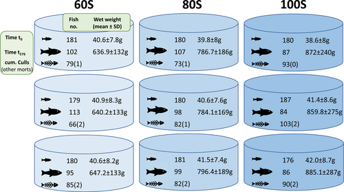

Fed aquaculture is one of the fastest-growing and most valuable food production industries in the world. The efficiency with which farmed fish convert feed into biomass influences both environmental impact and economic revenue. Salmonid species, such as king salmon (Oncorhynchus tshawytscha), exhibit high levels of plasticity in vital rates such as feed intake and growth rates. Accurate estimations of individual variability in vital rates are important for production management. The use of mean trait values to evaluate feeding and growth performance can mask individual-level differences that potentially contribute to inefficiencies. Here, the authors apply a cohort integral projection model (IPM) framework to investigate individual variation in growth performance of 1625 individually tagged king salmon fed one of three distinct rations of 60%, 80%, and 100% satiation and tracked over a duration of 276 days. To capture the observed sigmoidal growth of individuals, they compared a nonlinear mixed-effects (logistic) model to a linear model used within the IPM framework. Ration significantly influenced several aspects of growth, both at the individual and at the cohort level. Mean final body mass and mean growth rate increased with ration; however, variance in body mass and feed intake also increased significantly over time. Trends in mean body mass and individual body mass variation were captured by both logistic and linear models, suggesting the linear model to be suitable for use in the IPM. The authors also observed that higher rations resulted in a decreasing proportion of individuals reaching the cohort's mean body mass or larger by the end of the experiment. This suggests that, in the present experiment, feeding to satiation did not produce the desired effects of efficient, fast, and uniform growth in juvenile king salmon. Although monitoring individuals through time is challenging in commercial aquaculture settings, recent technological advances combined with an IPM approach could provide new scope for tracking growth performance in experimental and farmed populations. Using the IPM framework might allow the exploration of other size-dependent processes affecting vital rate functions, such as competition and mortality.

Access the article [**here**](https://doi.org/10.1111/jfb.15499){.external target="_blank"}.

{fig-align="center"}