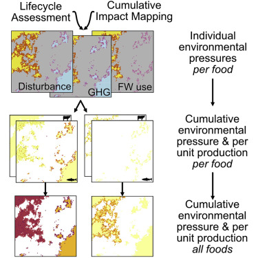

Feeding a growing, increasingly affluent population while limiting environmental pressures of food production is a central challenge for society. Understanding the location and magnitude of food production is key to addressing this challenge because pressures vary substantially across food production types. Applying data and models from life cycle assessment with the methodologies for mapping cumulative environmental impacts of human activities (hereafter cumulative impact mapping) provides a powerful approach to spatially map the cumulative environmental pressure of food production in a way that is consistent and comprehensive across food types. However, these methodologies have yet to be combined. By synthesizing life cycle assessment and cumulative impact mapping methodologies, we provide guidance for comprehensively and cumulatively mapping the environmental pressures (e.g., greenhouse gas emissions, spatial occupancy, and freshwater use) associated with food production systems. This spatial approach enables quantification of current and potential future environmental pressures, which is needed for decision makers to create more sustainable food policies and practices.

Access the article [**here**](https://doi.org/10.1016/j.oneear.2020.06.014){.external target="_blank"}.

{fig-align="center"}