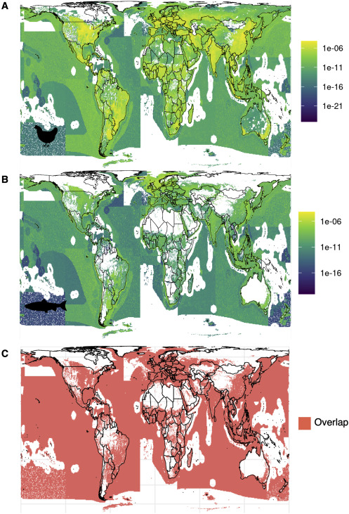

Food production, particularly of fed animals, is a leading cause of environmental degradation globally.1,2 Understanding where and how much environmental pressure different fed animal products exert is critical to designing effective food policies that promote sustainability.3 Here, we assess and compare the environmental footprint of farming industrial broiler chickens and farmed salmonids (salmon, marine trout, and Arctic char) to identify opportunities to reduce environmental pressures. We map cumulative environmental pressures (greenhouse gas emissions, nutrient pollution, freshwater use, and spatial disturbance), with particular focus on dynamics across the land and sea. We found that farming broiler chickens disturbs 9 times more area than farming salmon (∼924,000 vs. ∼103,500 km2) but yields 55 times greater production. The footprints of both sectors are extensive, but 95% of cumulative pressures are concentrated into <5% of total area. Surprisingly, the location of these pressures is similar (85.5% spatial overlap between chicken and salmon pressures), primarily due to shared feed ingredients. Environmental pressures from feed ingredients account for >78% and >69% of cumulative pressures of broiler chicken and farmed salmon production, respectively, and could represent a key leverage point to reduce environmental footprints. The environmental efficiency (cumulative pressures per tonne of production) also differs geographically, with areas of high efficiency revealing further potential to promote sustainability. The propagation of environmental pressures across the land and sea underscores the importance of integrating food policies across realms and sectors to advance food system sustainability.

Access the article [**here**](https://doi.org/10.1016/j.cub.2023.01.037){.external target="_blank"}.

{fig-align="center"}