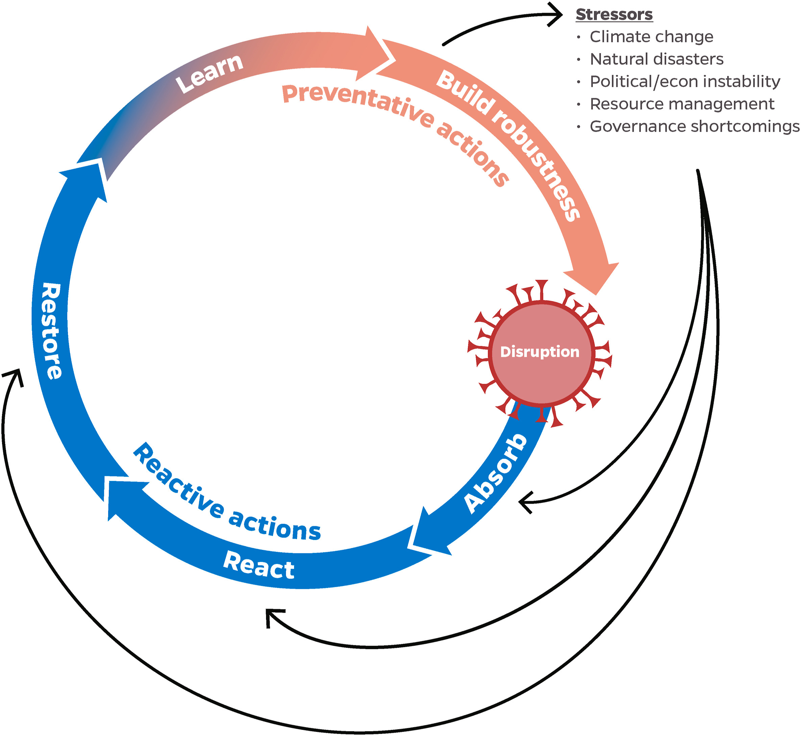

The COVID-19 pandemic and subsequent lockdowns are creating health and economic crises that threaten food and nutrition security. The seafood sector provides important sources of nutrition and employment, especially in low-income countries, and is highly globalized allowing shocks to propagate. We studied COVID-19-related disruptions, impacts, and responses to the seafood sector from January through May 2020, using a food system resilience ‘action cycle’ framework as a guide. We find that some supply chains, market segments, companies, small-scale actors and civil society have shown initial signs of greater resilience than others. COVID-19 has also highlighted the vulnerability of certain groups working in- or dependent on the seafood sector. We discuss early coping and adaptive responses combined with lessons from past shocks that could be considered when building resilience in the sector. We end with strategic research needs to support learning from COVID-19 impacts and responses.

Access the article [**here**](https://doi.org/10.1016/j.gfs.2021.100494){.external target="_blank"}.

{fig-align="center"}