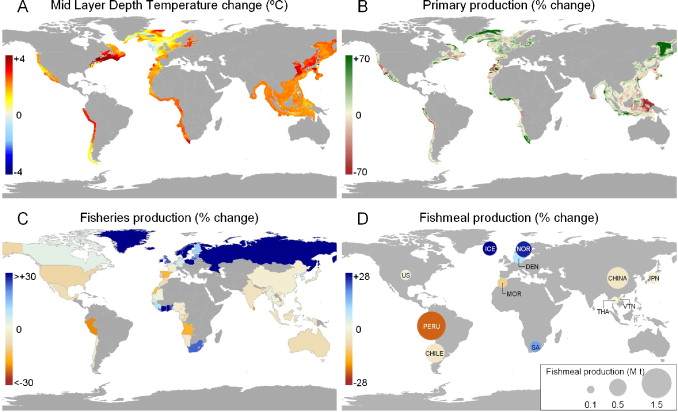

Expansion in the world's human population and economic development will increase future demand for fish products. As global fisheries yield is constrained by ecosystems productivity and management effectiveness, per capita fish consumption can only be maintained or increased if aquaculture makes an increasing contribution to the volume and stability of global fish supplies. Here, we use predictions of changes in global and regional climate (according to IPCC emissions scenario A1B), marine ecosystem and fisheries production estimates from high resolution regional models, human population size estimates from United Nations prospects, fishmeal and oil price estimations, and projections of the technological development in aquaculture feed technology, to investigate the feasibility of sustaining current and increased per capita fish consumption rates in 2050. We conclude that meeting current and larger consumption rates is feasible, despite a growing population and the impacts of climate change on potential fisheries production, but only if fish resources are managed sustainably and the animal feeds industry reduces its reliance on wild fish. Ineffective fisheries management and rising fishmeal prices driven by greater demand could, however, compromise future aquaculture production and the availability of fish products.

Access the article [**here**](https://doi.org/10.1016/j.gloenvcha.2012.03.003){.external target="_blank"}.

{fig-align="center"}