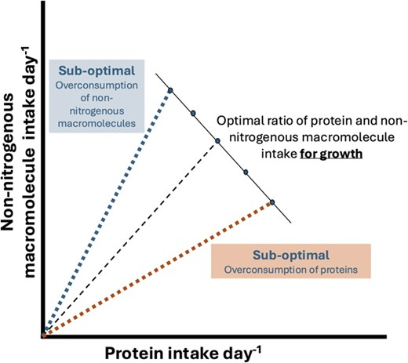

Aquaculture plays a crucial role in global food security and is being increasingly used to aid species and ecosystem conservation. However, concerns over environmental impact of aquaculture expansion are driving research into ecosystem approaches to aquaculture. Ecosystem approaches to aquaculture require understanding of the relationship between aquafeeds and aquaculture species to maximize consumer growth, quantify elemental flow of nutrients and minimize waste output. Conventional bioenergetic models typically assume fixed elemental ratios to quantify metabolic processes and do not consider an organism’s nutrient demand. A new bridging framework, Geometric Stoichiometry (GS), unifies nutritional geometry and ecological stoichiometry disciplines using macromolecules as currencies and dietary regulation to balance nutrient deficits and excesses by the consumer. We present the first application of the GS framework to aquaculture by investigating how different formulated feed ingredients affect intakes to maintain C:N homeostasis, growth and waste output using three opportunistic datasets for an emerging aquaculture species, slipper lobster (_Thenus australiensis_). Our GS model results indicate that protein sources and their inclusion levels drive the most variation in feed intake and growth. It also predicts highest nitrogenous waste for fish meal and lowest for squid by-product meal feeds. Our results highlight the need for targeted experiments to further refine the GS model to help support environmental management and formulate low-impact feeds for aquaculture.

Access the article [**here**](https://doi.org/10.1093/conphys/coaf066){.external target="_blank"}.

{fig-align="center"}