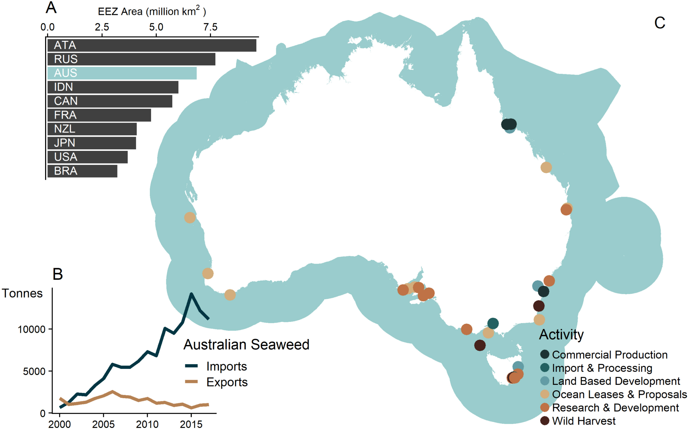

Large-scale seaweed aquaculture in the ocean is being pursued globally as a solution to many contemporary challenges, including climate change, food security, and ecosystem degradation. However, the required development and transformation of marine systems for farming may have unknown implications for sustainability objectives, such as those outlined in the United Nations Sustainable Development Goals (SDGs). The aim of this paper is to outline the opportunities for, and threats from, seaweed farming in the context of sustainability. We synthesise the perspectives of expert stakeholders from multiple sectors through a series of Australian workshops to catalogue the pathways through which seaweed farming may affect sustainability, giving specific focus to the SDGs. In doing so, this study illustrates that seaweed farming has the potential to influence, to some degree, the majority of SDGs, with both positive and negative influences. Indeed, seaweed farming is most likely to benefit progress towards achieving SDGs 2 (Zero Hunger), 8 (Decent Work and Economic Growth), 9 (Industry, Innovation, and Infrastructure), 12 (Sustainable Production and Consumption), and 15 (Life on Land). But expectations of seaweed farming may also fall short for supporting some goals if appropriate measures are not implemented to mitigate potential impacts, most notably SDG 14 (Life Below Water). We underscore that seaweed farming has the potential to contribute to sustainable development, and that this potential can only be realised with appropriate regulation and mitigation to avoid unwanted negative outcomes. Better identification and management of trade-offs between these potential positive and negative outcomes across sustainability domains, will be critical for realising the full potential of seaweed aquaculture for sustainable development.

Access the article [**here**](https://doi.org/10.1016/j.jclepro.2022.133052){.external target="_blank"}.

{fig-align="center"}