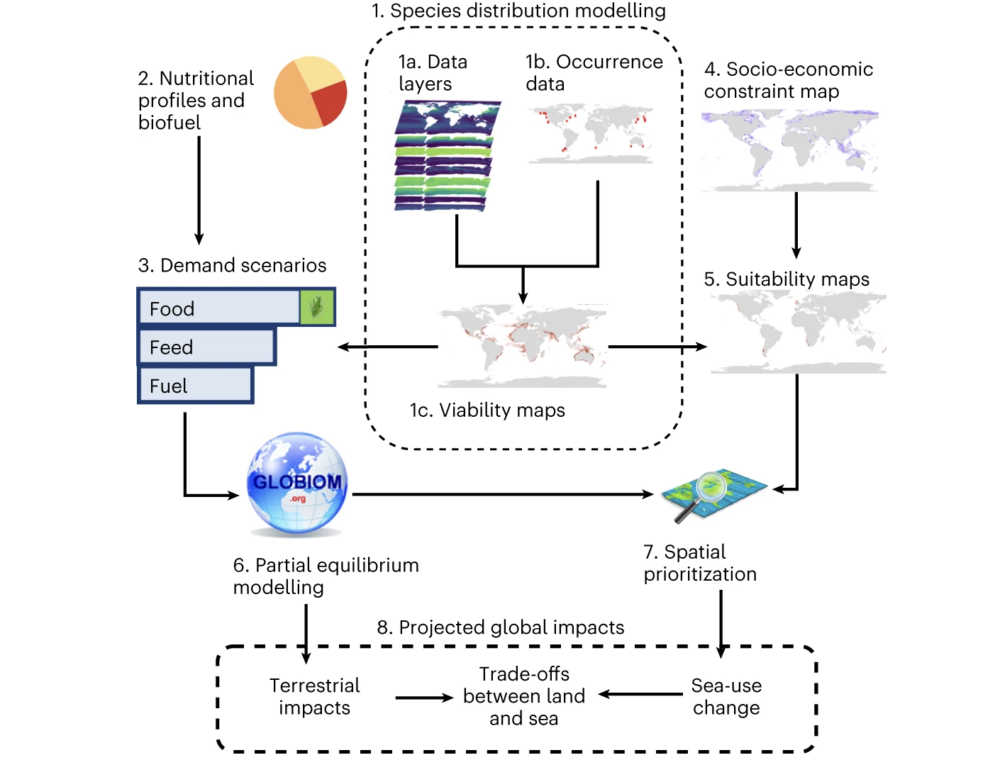

Agricultural expansion to meet humanity’s growing needs for food and materials is a leading driver of land-use change, exacerbating climate change and biodiversity loss. Seaweed biomass farmed in the ocean could help reduce demand for terrestrial crops and reduce agricultural greenhouse gas emissions by providing a substitute or supplement for food, animal feed and biofuels. Here we model the global expansion potential of seaweed farming and explore how increased seaweed utilization under five different scenarios that consider dietary, livestock feed and fuel production seaweed usage may affect the environmental footprint of agriculture. For each scenario, we estimate the change in environmental impacts on land from increased seaweed adoption and map plausible marine farming expansion on the basis of 34 commercially important seaweed species. We show that ~650 million hectares of global ocean could support seaweed farms. Cultivating Asparagopsis for ruminant feed provided the highest greenhouse gas mitigation of the scenarios considered (~2.6 Gt CO2e yr−1). Substituting human diets at a rate of 10% globally is predicted to spare up to 110 million hectares of land. We illustrate that global production of seaweed has the potential to reduce the environmental impacts of terrestrial agriculture, but caution is needed to ensure that these challenges are not displaced from the land to the ocean.

Access the article [**here**](https://doi.org/10.1038/s41893-022-01043-y){.external target="_blank"}.

{fig-align="center"}