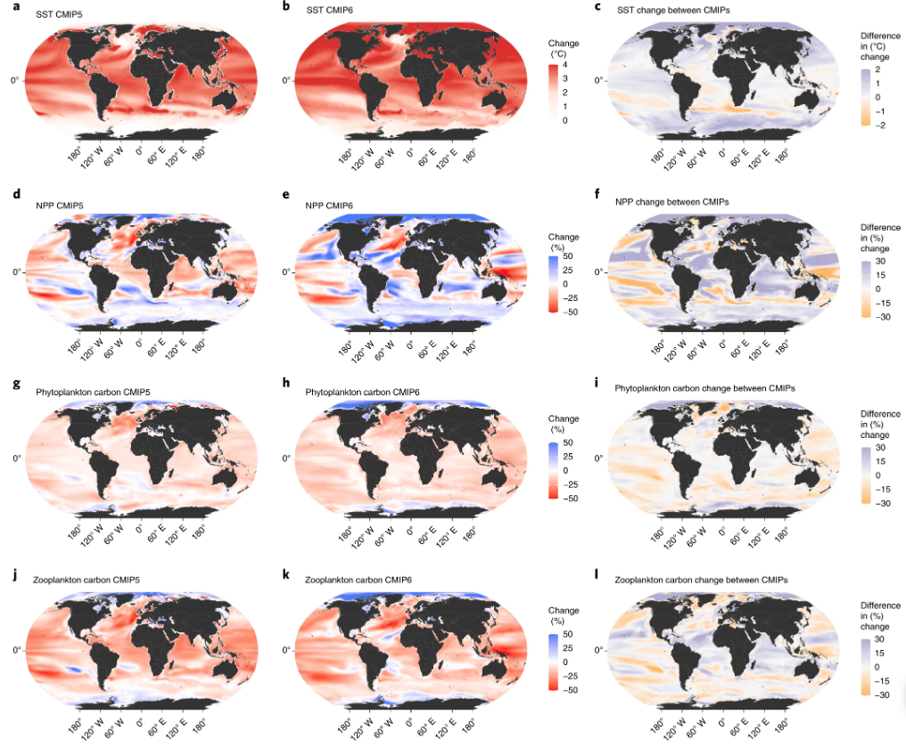

Projections of climate change impacts on marine ecosystems have revealed long-term declines in global marine animal biomass and unevenly distributed impacts on fisheries. Here we apply an enhanced suite of global marine ecosystem models from the Fisheries and Marine Ecosystem Model Intercomparison Project (Fish-MIP), forced by new-generation Earth system model outputs from Phase 6 of the Coupled Model Intercomparison Project (CMIP6), to provide insights into how projected climate change will affect future ocean ecosystems. Compared with the previous generation CMIP5-forced Fish-MIP ensemble, the new ensemble ecosystem simulations show a greater decline in mean global ocean animal biomass under both strong-mitigation and high-emissions scenarios due to elevated warming, despite greater uncertainty in net primary production in the high-emissions scenario. Regional shifts in the direction of biomass changes highlight the continued and urgent need to reduce uncertainty in the projected responses of marine ecosystems to climate change to help support adaptation planning.

Access the article [**here**](https://doi.org/10.1038/s41558-021-01173-9){.external target="_blank"}.

{fig-align="center"}