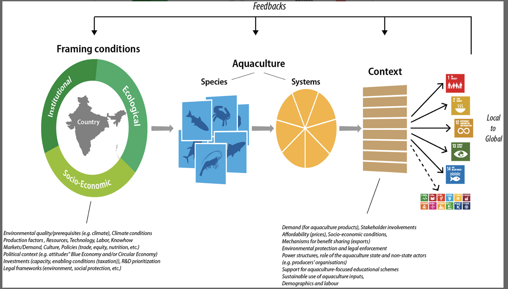

The diverse aquaculture sector makes important contributions toward achieving the Sustainable Development Goals (SDGs)/Agenda 2030, and can increasingly do so in the future. Its important role for food security, nutrition, livelihoods, economies, and cultures is not clearly visible in the Agenda 21 declaration. This may partly reflect the state of development of policies for aquaculture compared with its terrestrial counterpart, agriculture, and possibly also because aquaculture production has historically originated from a few key hotspot regions/countries. This review highlights the need for better integration of aquaculture in global food system dialogues. Unpacking aquaculture's diverse functions and generation of values at multiple spatiotemporal scales enables better understanding of aquaculture's present and future potential contribution to the SDGs. Aquaculture is a unique sector that encompasses all aquatic ecosystems (freshwater, brackish/estuarine, and marine) and is also tightly interconnected with terrestrial ecosystems through, for example, feed resources and other dependencies. Understanding environmental, social, and economic characteristics of the multifaceted nature of aquaculture provides for more context-specific solutions for addressing both opportunities and challenges for its future development. This review includes a rapid literature survey based on how aquaculture links to the specific SDG indicators. A conceptual framework is developed for communicating the importance of context specificity related to SDG outcomes from different types of aquaculture. The uniqueness of aquaculture's contributions compared with other food production systems are discussed, including understanding of species/systems diversity, the role of emerging aquaculture, and its interconnectedness with supporting systems. A selection of case studies is presented to illustrate: (1) the diversity of the aquaculture sector and what role this diversity can play for contributions to the SDGs, (2) examples of methodologies for identification of aquaculture's contribution to the SDGs, and (3) trade-offs between farming systems’ contribution to meeting the SDGs. It becomes clear that decision-making around resource allocation and trade-offs between aquaculture and other aquatic resource users needs review of a wide range of established and emergent systems. The review ends by highlighting knowledge gaps and pathways for transformation that will allow further strengthening of aquaculture's role for contributing to the SDGs. This includes identification and building on already existing monitoring that can enable capturing SDG-relevant aquaculture statistics at a national level and discussion of how a cohesive and comprehensive aquaculture strategy, framed to meet the SDGs, may help countries to prioritize actions for improving well-being.

Access the article [**here**](https://onlinelibrary.wiley.com/doi/full/10.1111/jwas.12946#){.external target="_blank"}.

{fig-align="center"}