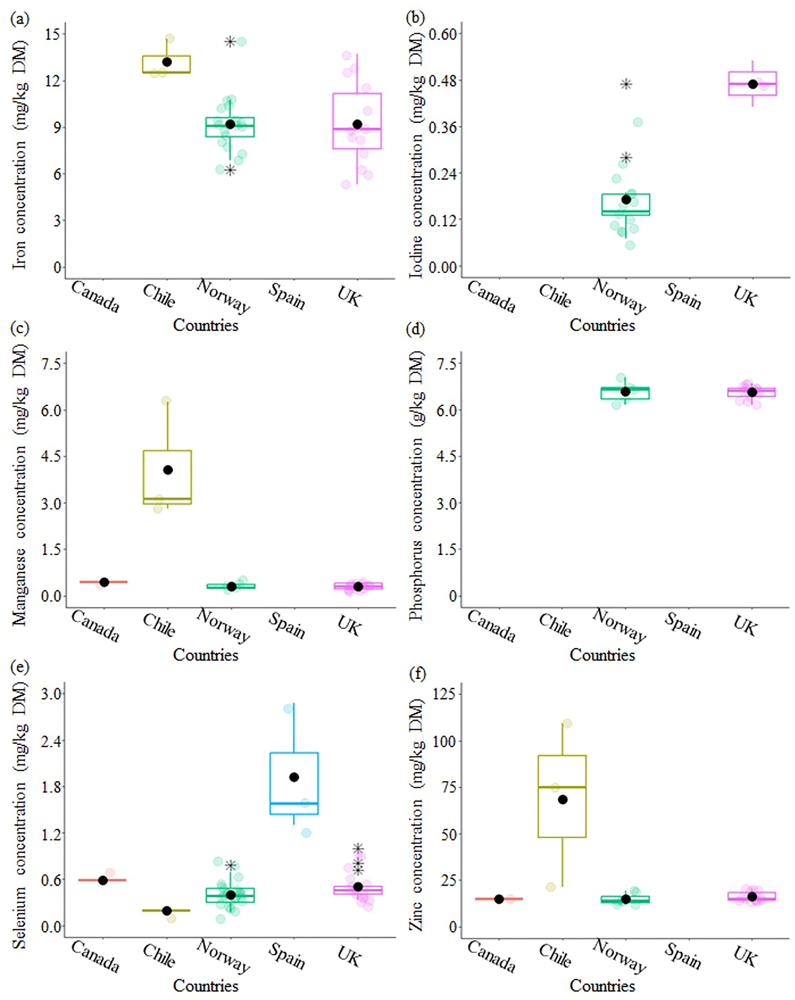

Atlantic salmon (_Salmo salar_) is valued for its nutritional benefits, but understanding of its mineral content remains limited. This synthesis compiles data from 107 studies (1990–2023) to explore factors influencing Atlantic salmon mineral composition. Most studies (77.6%) focused on small salmon (0–1 kg) from Norway, with limited data on Chilean and Australian Atlantic salmon. Geographical differences were noted: Chilean Atlantic salmon had higher iron and zinc, while UK and Spanish Atlantic salmon had higher iodine and selenium levels. The synthesis highlights the need for more data on larger salmon (> 3 kg) at harvest worldwide. Most data originated from feed experiments, with fewer studies on commercial salmon. Mineral levels varied between freshwater- and seawater-reared salmon, stressing the importance of diverse farm environments. Most studies focus on whole-body mineral content, highlighting the need for more research on edible portions like muscle and skin. Increasing feed mineral concentrations could enhance salmon tissue mineral levels, suggesting biofortification as a strategy to improve the nutritional quality of salmon. These findings highlight actionable strategies to enhance human nutrition through informed dietary recommendations and support aquaculture policies aimed at optimizing feed formulations and farming practices to improve the nutritional value of salmon for global consumption.

Access the article [**here**](https://doi.org/10.1080/29932181.2025.2487336){.external target="_blank"}.

{fig-align="center"}